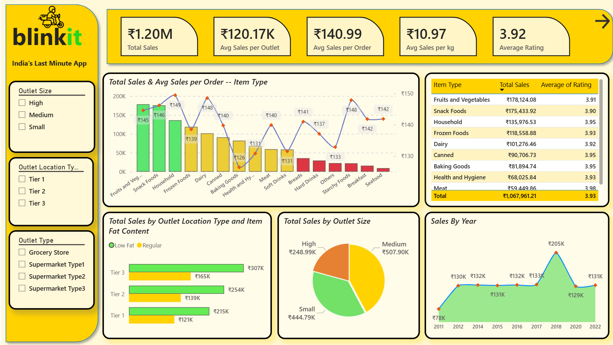
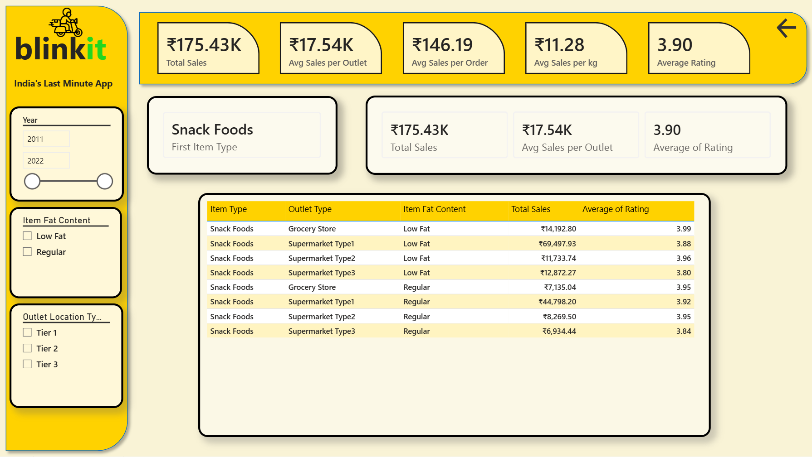

# Blinkit Sales Performance & Operational Analysis

### Project Overview
This project is a comprehensive **Business Intelligence** solution designed to analyze Blinkit’s sales performance, customer satisfaction, and inventory distribution. Leveraging my background in visual precision as a former Texturing Artist, I focused on creating a high-performance, intuitive dashboard that bridges the gap between massive grocery datasets and actionable executive decisions.

### Tech Stack
* **Analytics Tool:** Power BI Desktop
* **Data Modeling:** Star Schema (Fact and Dimension tables)
* **Logic:** Advanced DAX (Measures for dynamic KPIs and YoY analysis)
* **Visualization:** Custom UX/UI design with high-contrast, accessible metrics.

---

### Core Business KPIs
I implemented a primary executive header to provide a real-time health check of the business:
* **Total Sales:** ₹1.20M — Representing the gross revenue generated across all outlets.
* **Average Sales per Outlet:** ₹120.17K — A key metric for assessing infrastructure efficiency.
* **Average Sales per Order:** ₹140.99 — Indicating the average consumer basket value.
* **Avg Sales per kg:** ₹10.97 — Quantifying the weight-to-value ratio of moved inventory.
* **Average Rating:** 3.92 — A critical measure of customer sentiment and service quality.

---

### Project Screenshots
| Executive Sales Overview | Advanced Analytics View | Drill-Through Page
| :---: | :---: |
| :---: |
|  |  |  |

---

### Business Deep-Dive & Advanced Features

#### 1. Strategic Inventory Segmentation
The analysis tracks sales across 16 different item categories. 
* **Top Performers:** 'Fruits and Vegetables' (₹178K) and 'Snack Foods' (₹175K) drive the highest volume.
* **Fat Content Analysis:** I segmented sales by 'Low Fat' vs. 'Regular' content across different outlet tiers. This revealed that **Tier 3 locations** dominate in 'Regular' fat content sales (₹307K), suggesting a geographic variance in dietary preferences.

#### 2. Advanced Drill-Through Analysis
To move from high-level summaries to operational details, I developed a specialized **Drill-Through page**:
* **The Function:** Users can right-click any 'Item Type' or 'Outlet' to navigate to a granular performance profile.
* **Granular Tracking:** This view breaks down metrics by 'Outlet Type' (Grocery Store vs. Supermarket Types), correlating specific sales figures with average ratings to identify exactly where service is failing or succeeding.

#### 3. Operational Visibility & Efficiency
I utilized a **Scatter/Bubble Plot** to correlate 'Item Visibility' with 'Total Sales'.
* **Insight:** I identified "Hidden Stars"—items with low visibility but high sales—recommending a change in app placement to maximize latent revenue.
* **Outlet Scaling:** Analyzed that **Supermarket Type 1** handles the largest volume of items (5,577) and generates the highest total sales (₹787.55K), marking it as the most efficient model for future expansion.

---

### Strategic Recommendations
Based on the data, the following business actions are proposed:
1. **Tiered Expansion:** Prioritize the **Supermarket Type 1** model for new launches, as it maintains the best balance of scale and revenue.
2. **Dynamic Stocking:** Increase inventory for **Fruits and Vegetables** in Tier 3 locations, where they outperform all other categories.
3. **Rating Recovery:** Investigate **Supermarket Type 3** locations; despite high sales, they show a dip in average rating compared to Grocery Stores.

---
